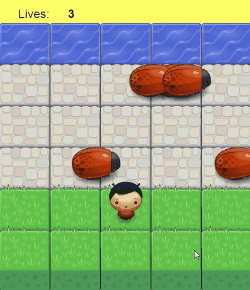

frontend-nanodegree-arcade-game
===============================

## The Game

It's a variant of classical frogger game. 

The player starts with some lives. The target is to reach the river to
earn more lives.

Use `Left`, `Right`, `Up`, and `Down` keys to control your hero.

Avoid bugs. Every time the hero collides with a bug a life is gone.

When lives count reaches zero game ends.

Reload the page to restart.

## Original Task

Students should use this
[rubric](https://review.udacity.com/#!/projects/2696458597/rubric)
for self-checking their submission. Make sure the functions you write
are **object-oriented** - either class functions (like Player and Enemy) 
or class prototype functions such as Enemy.prototype.checkCollisions, 
and that the keyword 'this' is used appropriately within your class and 
class prototype functions to refer to the object the function is called upon. 
Also be sure that the **readme.md** file is updated with your instructions 
on both how to 1. Run and 2. Play your arcade game.

For detailed instructions on how to get started, check out this
[guide](https://docs.google.com/document/d/1v01aScPjSWCCWQLIpFqvg3-vXLH2e8_SZQKC8jNO0Dc/pub?embedded=true).

## Student Developer Notes

When completing the original task, consider reviewing
[original repo issues](https://github.com/udacity/frontend-nanodegree-arcade-game/issues/)
and particularly
[this one](https://github.com/udacity/frontend-nanodegree-arcade-game/issues/5).

This project [TODO list](TODO.md).
